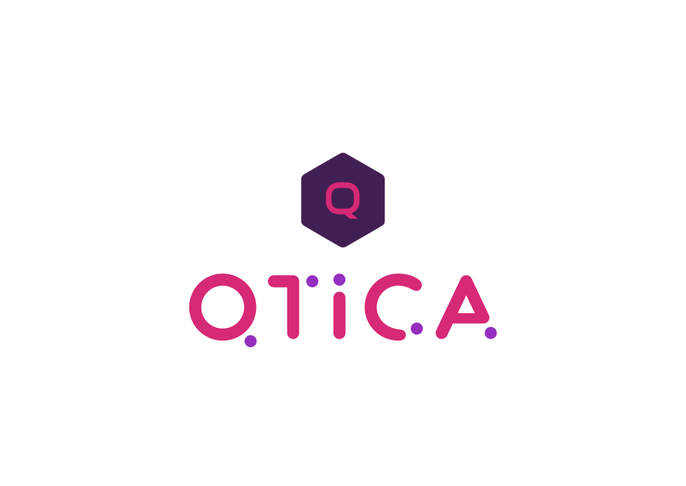

  

  A Fast Way to Done Your Idea!

Qtica is a Python library that provides a lightweight API around native PySide6, allowing for lightning-fast GUI prototyping using modern declarative UI techniques entirely within Python.

# It's ready to use, Please waiting for the docs!
